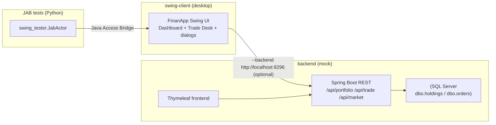

# swing-jab-tester-sample

A complete, runnable **sample** for [`swing-jab-tester`](../swing-jab-tester) — a desktop Java
**Swing stock-trading app** plus a **SQL-backed REST mock**, wired together so you can see the whole
agent-driven testing loop on a realistic app, **driven by a GitHub Copilot–hosted agent** (the same
Copilot SDK host as the `computer-use` CUA) or by the plain Python tests.

It exists so you have something concrete to copy from: a real multi-window Swing UI with login,
tables, a trade form, cascading/modal dialogs, and a database-backed mode — all driven and verified
through the Java Access Bridge.

## Two parts

```
swing-client/   The desktop app (single-file Java Swing) + its JAB-driven Python tests
backend/        The SQL-backed mock: Spring Boot REST API + SQL Server schema + Thymeleaf frontend
```

### Architecture



The Swing client runs **in-memory by default** (no backend needed — great for the UI tests). Pass
`--backend http://localhost:9296` and it reads/writes through the REST API to **SQL Server** instead.

## Quick start (UI only, no database)

```powershell
# 1. install the tester (companion repo) into a venv
python -m venv .venv; .\.venv\Scripts\Activate.ps1
pip install -e ..\swing-jab-tester

# 2. run the app (opens across your monitors; pick a trader)
cd swing-client
.\run.ps1                       # or: .\run.ps1 -Trader JSMITH  to skip the splash

# 3. run the JAB-driven tests
python test_trade_flow.py           # login -> read holdings -> BUY -> SELL
python test_advanced_order.py       # cascading modeless dialog (progressive disclosure)
python test_advanced_order_modal.py # the same flow as a MODAL dialog (mouse-click fallback)
```

## With the SQL backend

See **[docs/SETUP.md](docs/SETUP.md)** to bring up SQL Server + the Spring Boot app, then:

```powershell
cd swing-client
python test_trade_flow_sql.py       # drives the app in --backend mode, verifies dbo.holdings via sqlcmd
```

## The tests

| Test | What it proves |
|------|----------------|
| `test_trade_flow.py` | login → read holdings table → BUY 100 → SELL 100, verified by the in-app `Own:` oracle |
| `test_advanced_order.py` | progressive disclosure in a **modeless** dialog (reveal Limit price → advanced panel → summary → Confirm) |
| `test_advanced_order_modal.py` | the same cascade in a **modal** dialog, driven by the mouse-click fallback |
| `test_trade_flow_sql.py` | end-to-end persistence: app → REST → **SQL Server**, asserted with `sqlcmd` |

## The worked scenario

**[docs/SCENARIO-add-test-validate-e2e.md](docs/SCENARIO-add-test-validate-e2e.md)** walks the full
loop on this app: **add a feature → write a JAB test → validate it → run the end-to-end (SQL) test** —
the pattern you'd repeat on your own Swing app.

## Mock data (two trader profiles)

| Profile | Name | Style | Holdings |
|---|---|---|---|
| `JSMITH` | James Smith | Aggressive growth | NVDA, AAPL, MSFT, TSLA, AMZN, META |
| `MWILSON` | Maria Wilson | Conservative value | JNJ, JPM, PG, KO, BRK.B, GOOGL, V, XOM |

Backend setup, schema, and seed data live under **[backend/](backend/)** (see `backend/README.md`).
